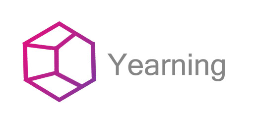
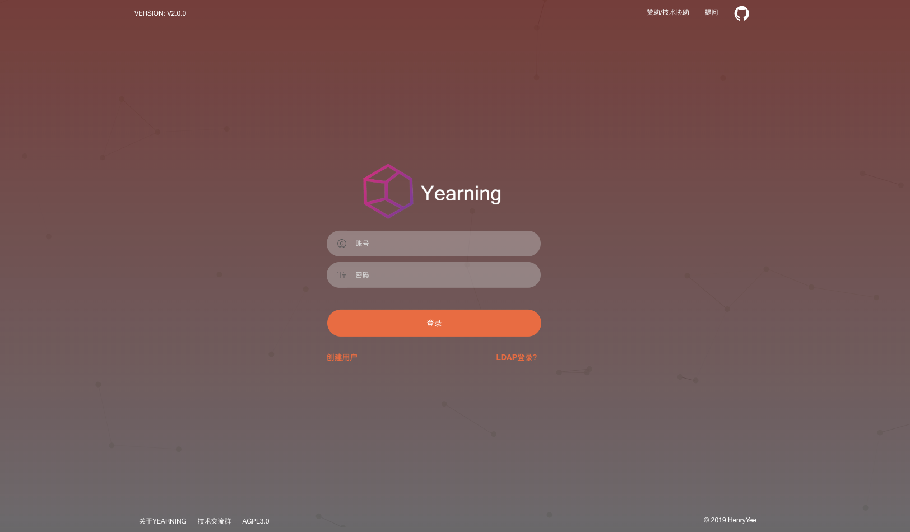
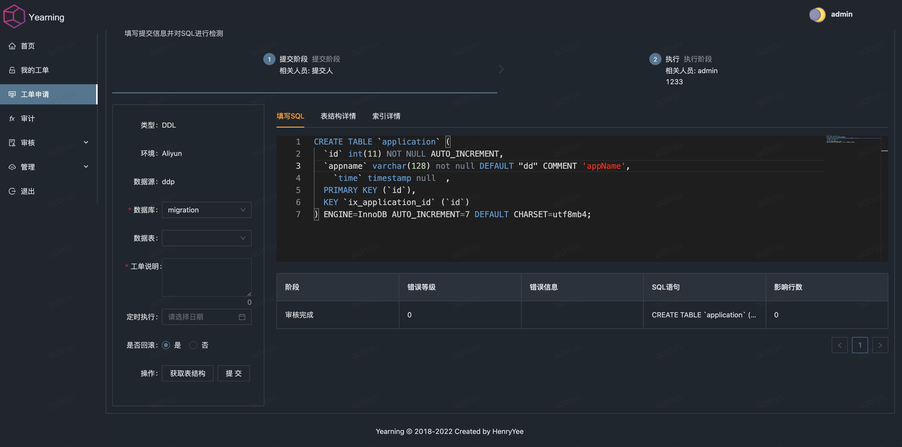
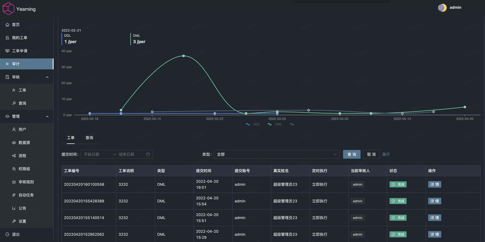

        

# Yearning SQL 审核平台

  

##### MYSQL web 端 SQL 审核平台。

## US_EN

[US_EN guide](README_EN.md)

## Depend on 依赖项

[Gemini](https://github.com/cookieY/gemini-next) front-end

[Yee](https://github.com/cookieY/yee) web framwork

## Website 官网

[next.yearning.io](http://next.yearning.io)

## Community 社区

[Gitter](https://gitter.im/talk-to-yearning/community?utm_source=share-link&utm_medium=link&utm_campaign=share-link)

Yearning 使用交流QQ群 1群: 747364310(已满) 2群:363323798
## Feature 功能

-   SQL 查询
    -   查询工单
    -   导出
    -   自动补全，智能提示
    -   查询语句审计
    -   查询结果脱敏
-   SQL 审核
    -   流程化工单
    -   SQL语句语法检测
    -   根据规则检测SQL语句合规性    
    -   自动生成DDL/DML回滚语句
    -   历史审核记录
-   推送
    -   E-mail 工单推送
    -   钉钉 webhook 机器人工单推送
-   用户权限及管理
    - 角色划分
    - 基于用户的细粒度权限
    - 注册
-   其他
    -   todoList
    -   LDAP 登录
    -   动态审核规则配置
    -   自定义审核层级
    -   OIDC SSO 自动注册与登录
-   AutoTask 自执行

## Install 安装及使用日志

[使用及安装文档](https://next.yearning.io) 解决 95%的疑问,不做十万个为什么!

## Develop 二次开发

[二次开发注意事项](https://next.yearning.io/dev/declare.html)

## About 联系方式

E-mail: henry@yearning.io

## Recommend 推荐

[Spug - 开源轻量自动化运维平台](https://github.com/openspug/spug)

## Snapshot 效果展示

-   Login

- OIDC Login (Keycloak 为例)

- Dashboard

-   审核

-   查询(SQL 语法高亮及自动补全)

-   审计(工单审计)

## License

-   AGPL v3

任何二次开发及二次开源项目请严格遵守相应开源许可

2021 © Henry Yee
