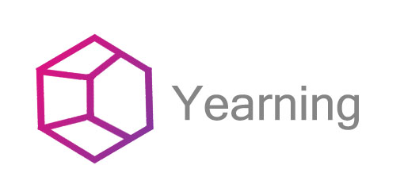
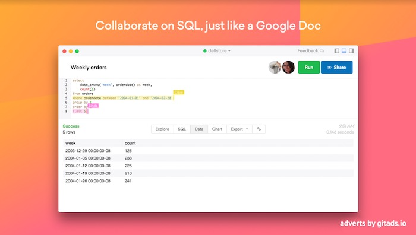
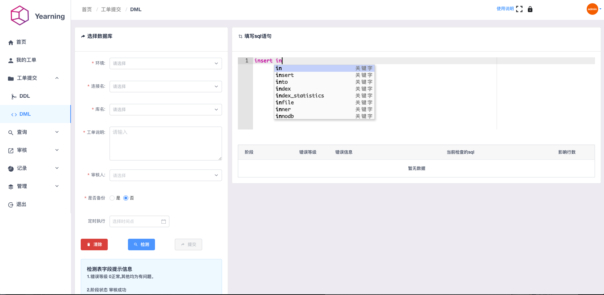

        

# Yearning SQL 审核平台

  

##### MYSQL web 端 SQL 审核平台。

 <i>This advert was placed by <a href="https://tracking.gitads.io/?campaign=gitads&repo=Yearning&redirect=gitads.io" rel="gitads">GitAds</a> </i>

## US_EN

[US_EN guide](README_EN.md)

## Yearning2.0 前端项目

[Gemini](https://github.com/cookieY/Yearning-gemini)

## Website 官网

[www.yearning.io](http://yearning.io)

## Community 社区

Yearning2.0(Go) 使用交流 Q 群: 747364310

## Feature 功能

- SQL 查询
  - 查询工单
  - 导出
  - 自动补全，智能提示
  - 查询语句审计
- SQL 审核
  - 流程化工单
  - SQL 语句检测与执行
  - SQL 回滚
  - 历史审核记录
- 推送
  - E-mail 工单推送
  - 钉钉 webhook 机器人工单推送
- 用户权限及管理
  - 角色划分
  - 基于用户的细粒度权限
  - 注册
- 其他
  - todoList
  - LDAP 登录
  - 动态审核规则配置
- AutoTask 自动执行

## Install 安装及使用日志

[使用及安装文档](http://guide.yearning.io)

## Develop 二次开发

[二次开发注意事项](https://guide.yearning.io/developer.html)

## About 联系方式

E-mail: henry@yearning.io

## Snapshot 效果展示

- Login

- Dashboard

- 审核

- SQL 语法高亮及自动补全

- 查询

- 细粒度的权限分配
  

- 我的工单
  

## License

- AGPL v3

任何二次开发及二次开源项目请严格遵守相应开源许可

2019 © Henry Yee
