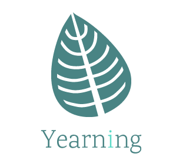
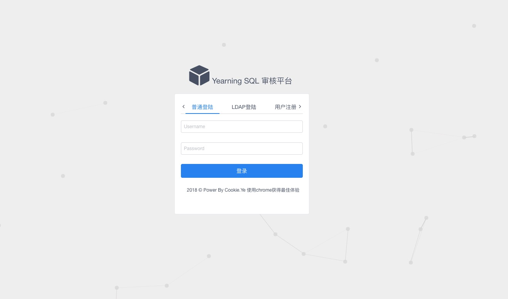
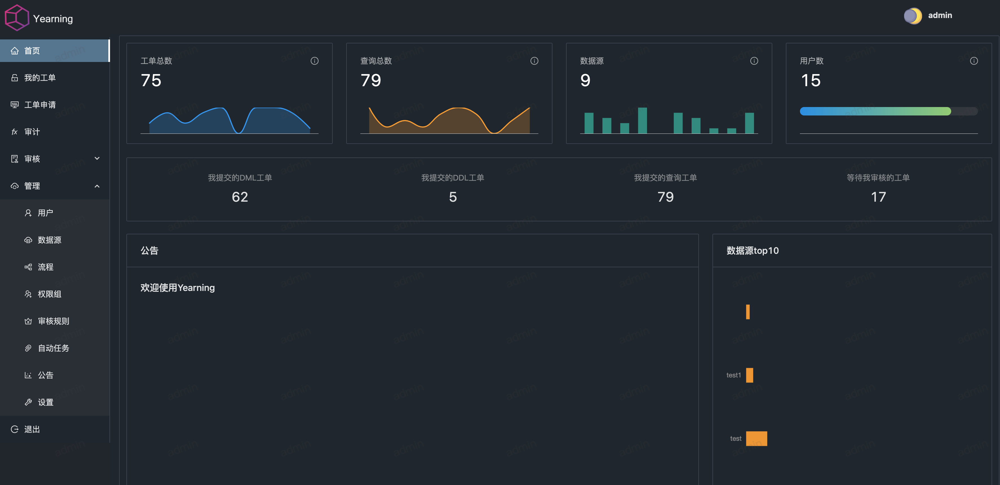
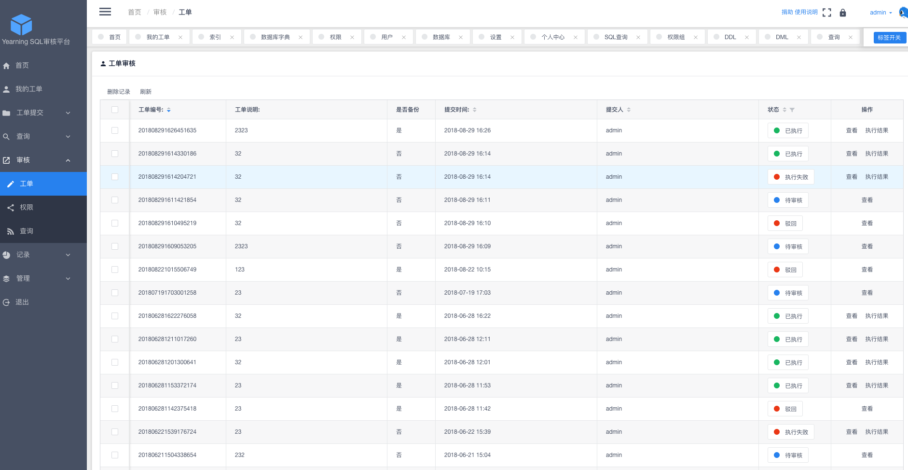
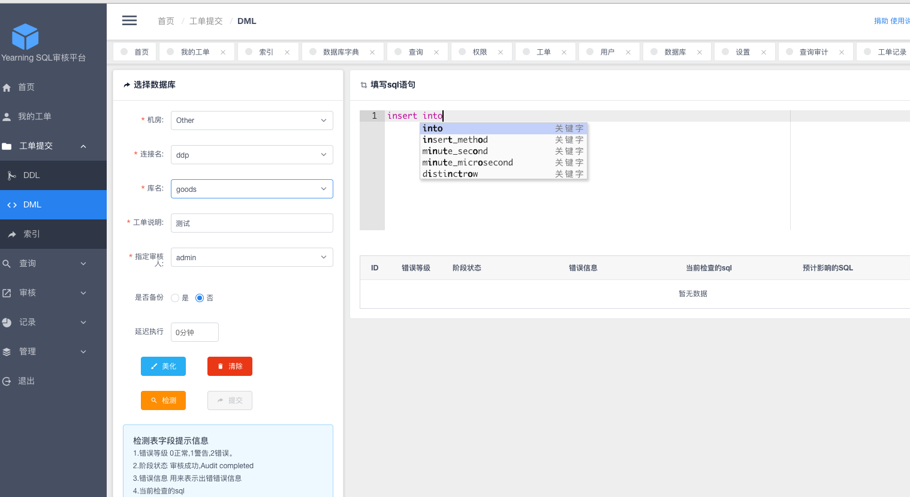
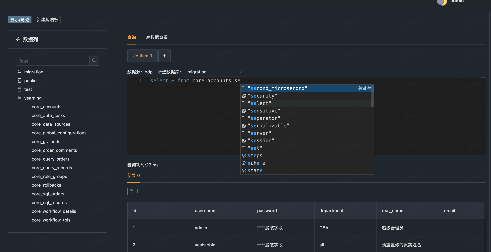
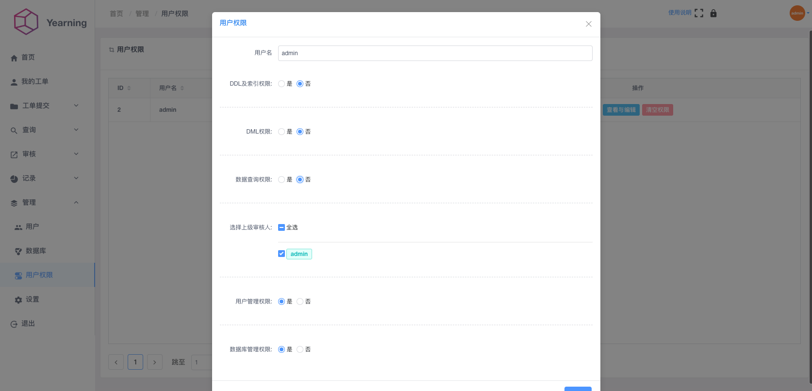
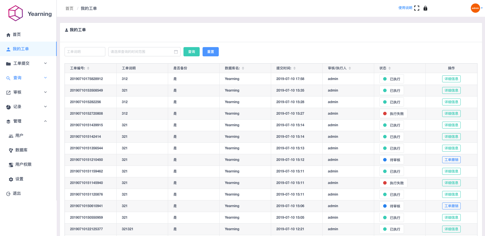

        

# Yearning SQL审核平台

  
  
 
 

##### MYSQL web端 SQL审核平台。

## Website 官网

[www.yearning.io](http://yearning.io)

## Feature 功能

- SQL查询
    - 查询工单 
    - 导出
    - 自动补全，智能提示 
    - 查询语句审计
- SQL审核
    - 流程化工单
    - SQL语句检测与执行
    - SQL回滚
    - 历史审核记录
- 推送
    - E-mail工单推送
    - 钉钉webhook机器人工单推送
- 用户权限及管理
    - 拼图式权限划分
    - 组合式权限组
    - 支持限制邮箱后缀名的有限注册功能
- 其他
    - todoList
    - LDAP登录  
    - 动态配置 

## Environment 环境

- Python 3.6

- Vue.js 2.5

- Django 2.1.5

## Install 安装及使用日志

[使用及安装文档](http://guide.yearning.io)

## Support 支持Yearning

如果Yearning能够帮助到你，请支持下Yearning吧，让Yearning能够持续改善并更新

  
## About 联系方式
   
   QQ群:103674679
   
   E-mail: im@supermancookie.com

## Snapshot 效果展示

- Login

- Dashboard

- 审核

- SQL语法高亮及自动补全

- 查询

- 细粒度的权限分配

- 我的工单

## License

- AGPL v3

任何二次开发及二次开源项目请严格遵守相应开源许可

2018 © Cookie

