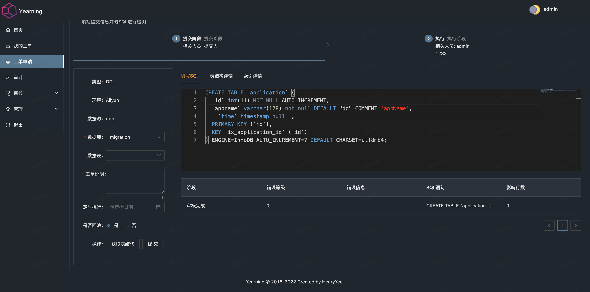
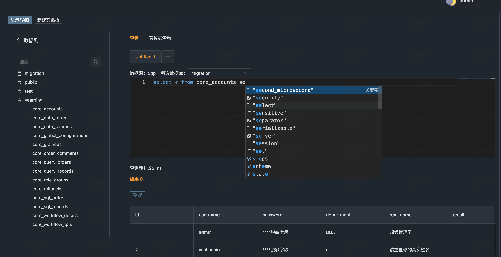
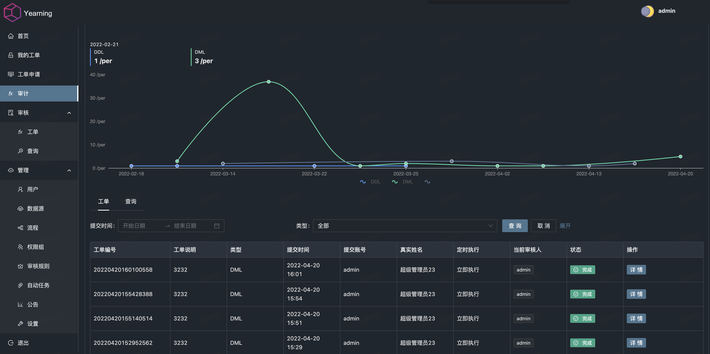

<div align="right">
  <details>
    <summary >🌐 Language</summary>
    <div>
      <div align="right">
        <p><a href="https://openaitx.github.io/view.html?user=cookieY&project=Yearning&lang=en">English</a></p>
        <p><a href="https://openaitx.github.io/view.html?user=cookieY&project=Yearning&lang=zh-CN">简体中文</a></p>
        <p><a href="https://openaitx.github.io/view.html?user=cookieY&project=Yearning&lang=zh-TW">繁體中文</a></p>
        <p><a href="https://openaitx.github.io/view.html?user=cookieY&project=Yearning&lang=ja">日本語</a></p>
        <p><a href="https://openaitx.github.io/view.html?user=cookieY&project=Yearning&lang=ko">한국어</a></p>
        <p><a href="https://openaitx.github.io/view.html?user=cookieY&project=Yearning&lang=hi">हिन्दी</a></p>
        <p><a href="https://openaitx.github.io/view.html?user=cookieY&project=Yearning&lang=th">ไทย</a></p>
        <p><a href="https://openaitx.github.io/view.html?user=cookieY&project=Yearning&lang=fr">Français</a></p>
        <p><a href="https://openaitx.github.io/view.html?user=cookieY&project=Yearning&lang=de">Deutsch</a></p>
        <p><a href="https://openaitx.github.io/view.html?user=cookieY&project=Yearning&lang=es">Español</a></p>
        <p><a href="https://openaitx.github.io/view.html?user=cookieY&project=Yearning&lang=it">Itapano</a></p>
        <p><a href="https://openaitx.github.io/view.html?user=cookieY&project=Yearning&lang=ru">Русский</a></p>
        <p><a href="https://openaitx.github.io/view.html?user=cookieY&project=Yearning&lang=pt">Português</a></p>
        <p><a href="https://openaitx.github.io/view.html?user=cookieY&project=Yearning&lang=nl">Nederlands</a></p>
        <p><a href="https://openaitx.github.io/view.html?user=cookieY&project=Yearning&lang=pl">Polski</a></p>
        <p><a href="https://openaitx.github.io/view.html?user=cookieY&project=Yearning&lang=ar">العربية</a></p>
        <p><a href="https://openaitx.github.io/view.html?user=cookieY&project=Yearning&lang=fa">فارسی</a></p>
        <p><a href="https://openaitx.github.io/view.html?user=cookieY&project=Yearning&lang=tr">Türkçe</a></p>
        <p><a href="https://openaitx.github.io/view.html?user=cookieY&project=Yearning&lang=vi">Tiếng Việt</a></p>
        <p><a href="https://openaitx.github.io/view.html?user=cookieY&project=Yearning&lang=id">Bahasa Indonesia</a></p>
      </div>
    </div>
  </details>
</div>

<div align="center">

<h1 style="border-bottom: none">
    <b><a href="https://next.yearning.io">Yearning</a></b><br />
</h1>
</div>

 A robust, locally deployed platform designed for seamless SQL detection and query auditing, tailored specifically for DBAs and developers. Focused on privacy and efficiency, it provides an intuitive and secure environment for MYSQL auditing.

---
[](https://www.murphysec.com/dr/nDuoncnUbuFMdrZsh7)
?style=flat-square&logoColor=white&logo=linux)
[![][github-license-shield]][github-license-link]

[![][github-forks-shield]][github-forks-link]
[![][github-stars-shield]][github-stars-link]
[](https://github.com/cookieY/Yearning/releases/latest)

English | [简体中文](README.zh-CN.md) | [日本語](README.ja-JP.md)

## ✨ Features

- **AI Assistant**: Our AI assistant offers real-time SQL optimization suggestions, enhancing SQL performance. It also supports text-to-SQL conversion, allowing users to input natural language and receive optimized SQL statements.
  
- **SQL Audit**: Create SQL audit tickets with approval workflows and automated syntax checks. Validate SQL statements for correctness, security, and compliance. Rollback statements are automatically generated for DDL/DML operations, with a comprehensive history log for traceability.

- **Query Audit**: Audit user queries, restrict data sources and databases, and anonymize sensitive fields. Query records are saved for future reference.

- **Check Rules**: Our automated syntax checker supports a wide range of check rules, suitable for most automatic checking scenarios.

- **Privacy Focused**: Yearning is a locally deployable, open-source solution that ensures the security of your database and SQL statements. It includes encryption mechanisms to protect sensitive data, ensuring it remains secure even if unauthorized access occurs.

- **RBAC (Role-Based Access Control)**: Create and manage roles with specific permissions, restricting access to query work orders, auditing functions, and other sensitive operations based on user roles.

> \[!TIP]
> For more detailed information, visit our [Yearning Guide](https://next.yearning.io)


## ⚙️ Installation

Download the [latest release](https://github.com/cookieY/Yearning/releases/latest) and extract it. Ensure you have configured `./config.toml` before proceeding.

### Manual Installation

```bash
## Initialize the database
./Yearning install

## Start Yearning
./Yearning run

## Help
./Yearning --help
```

### 🚀 Deploying with Docker
[![][docker-release-shield]][docker-release-link]
[![][docker-size-shield]][docker-size-link]
[![][docker-pulls-shield]][docker-pulls-link]
```bash
## Initialize the database
docker run --rm -it -p8000:8000 -e SECRET_KEY=$SECRET_KEY -e MYSQL_USER=$MYSQL_USER -e MYSQL_ADDR=$MYSQL_ADDR -e MYSQL_PASSWORD=$MYSQL_PASSWORD -e MYSQL_DB=$Yearning_DB -e Y_LANG=zh_CN yeelabs/yearning "/opt/Yearning install"

## Start Yearning
docker run -d -it -p8000:8000 -e SECRET_KEY=$SECRET_KEY -e MYSQL_USER=$MYSQL_USER -e MYSQL_ADDR=$MYSQL_ADDR -e MYSQL_PASSWORD=$MYSQL_PASSWORD -e MYSQL_DB=$Yearning_DB -e Y_LANG=zh_CN yeelabs/yearning
```
## 🤖 AI Assistance

Our AI Assistant leverages a large language model to provide SQL optimization suggestions and text-to-SQL conversion. Whether using default or custom prompts, the AI Assistant enhances SQL performance by optimizing statements and converting natural language inputs into SQL queries.


## 🔖 Automatic SQL Checker

The automatic SQL checker evaluates SQL statements against predefined rules and syntax. It ensures that statements adhere to specific coding standards, best practices, and security requirements, providing a robust layer of validation.



## 💡 SQL Syntax Highlighting and Auto-completion

Enhance your query writing efficiency with SQL syntax highlighting and auto-completion. These features help users visually distinguish different components of a SQL query, such as keywords, table names, column names, and operators, making it easier to read and understand the query structure.



## ⏺️ Order/Query Record

Our platform supports the auditing of user order and query statements. This feature allows you to track and record all query operations, including data sources, databases, and the handling of sensitive fields, ensuring compliance with regulations and providing traceability for query history.



By focusing on these key features, Yearning enhances user experience, optimizes SQL performance, and ensures robust compliance and traceability in database operations.

## 🛠️ Recommended Tools

- [Spug - Open Source Lightweight Automation Operations Platform](https://github.com/openspug/spug)

## ☎️ Contact

For inquiries, please email us at: henry@yearning.io

## 📋 License

Yearning is licensed under the AGPL license. See [LICENSE](LICENSE) for details.

2024 © Henry Yee

---

With Yearning, experience a streamlined, secure, and efficient approach to SQL auditing and optimization.


[docker-pulls-link]: https://hub.docker.com/r/yeelabs/yearning
[docker-pulls-shield]: https://img.shields.io/docker/pulls/yeelabs/yearning?color=45cc11&labelColor=black&style=flat-square
[docker-release-link]: https://hub.docker.com/r/yeelabs/yearning
[docker-release-shield]: https://img.shields.io/docker/v/yeelabs/yearning?color=369eff&label=docker&labelColor=black&logo=docker&logoColor=white&style=flat-square
[docker-size-link]: https://hub.docker.com/r/yeelabs/yearning
[docker-size-shield]: https://img.shields.io/docker/image-size/yeelabs/yearning?color=369eff&labelColor=black&style=flat-square
[github-forks-shield]: https://img.shields.io/github/forks/cookieY/Yearning?color=8ae8ff&labelColor=black&style=flat-square
[github-forks-link]: https://github.com/cookieY/Yearning/network/members
[github-stars-link]: https://github.com/cookieY/Yearning/network/stargazers
[github-stars-shield]: https://img.shields.io/github/stars/cookieY/Yearning?color=ffcb47&labelColor=black&style=flat-square
[github-license-link]: https://github.com/cookieY/Yearning/blob/main/LICENSE
[github-license-shield]: https://img.shields.io/badge/AGPL%203.0-white?labelColor=black&style=flat-square
