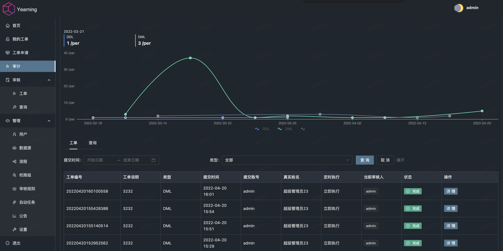

<div align="center">

<h1 style="border-bottom: none">
    <b><a href="https://next.yearning.io">Yearning</a></b><br />
        简单, 高效的MYSQL 审计平台
    <br>
</h1>
<p>
一款MYSQL SQL语句/查询审计工具，为DBA与开发人员使用. <br />
本地部署，注重隐私，简单高效的MYSQL审计平台。
</p>
</div>
<div align="center">

?style=flat-square&logoColor=white&logo=linux)
[](https://www.murphysec.com/dr/nDuoncnUbuFMdrZsh7)


[](https://github.com/cookieY/Yearning/releases/latest)
</div>

[English](README.md) | 简体中文

## 功能

- **SQL审计** - 支持创建带有批准工作流和自动语法检查器的SQL审计工单，以验证提交的SQL语句的正确性、安全性和合规性。在需要时自动生成与提交的DDL/DML操作相对应的回滚语句，方便恢复操作。保留所有SQL审计操作的详细历史记录，以实现可追溯性和审计目的。
- **查询审计** - 支持对用户查询语句进行审计，包括对数据源和数据库的限制，以及敏感字段的匿名化处理。查询记录也会被保存以供日后参考。
- **检查规则** - 自动语法检查器支持数十种检查规则，满足大多数自动检查场景的需求。
- **安全** - 可在本地部署并具有开源特性的解决方案确保您的数据库和SQL语句的安全。除了提供对基础架构的控制外，还包括加密机制，用于在将敏感数据存储到数据库之前保护数据。
- **RBAC** - 可以创建和管理不同角色，并为每个角色分配特定权限。这使您可以根据分配的角色限制用户对查询工单、审计功能和其他敏感操作的访问权限。

## 文档

[Yearning Docs](https://next.yearning.io)

## 安装

[下载](https://github.com/cookieY/Yearning/releases/latest) 获取最新版本。

**请确保已正确配置 ./config.toml**

#### 手动安装

```bash
## 初始化数据库
./Yearning install

## 启动
./Yearning run

## 帮助
./Yearning --help

```

**是的，就是这么简单**

#### Docker

```bash
## 初始化数据库
docker run -d -it -p8000:8000 -e SECRET_KEY=$SECRET_KEY -e MYSQL_USER=$MYSQL_USER -e MYSQL_ADDR=$MYSQL_ADDR -e MYSQL_PASSWORD=$MYSQL_PASSWORD -e MYSQL_DB=$Yearning_DB yeelabs/yearning "/opt/Yearning install"
## 必须在启动容器中初始化数据库
docker run -d -it -p8000:8000 -e SECRET_KEY=$SECRET_KEY -e MYSQL_USER=$MYSQL_USER -e MYSQL_ADDR=$MYSQL_ADDR -e MYSQL_PASSWORD=$MYSQL_PASSWORD -e MYSQL_DB=$Yearning_DB yeelabs/yearning
```

## 推荐

[Spug - 开源轻量自动化运维平台](https://github.com/openspug/spug)

<h1 align="center">自动SQL检测</h1>
<p align="center">
SQL语句检测功能根据预定义的规则和语法进行测试 <br /> 我们可以设置预定义的规则来检查SQL语句是否符合特定的编码标准已符合最佳实践或安全要求。
</p>

 

<br />
<h2 align="center">SQL 语法高亮及自动联想</h2>
<p align="center">
SQL语法高亮显示和自动完成功能，以增强用户体验并提高查询编写效率。<br />SQL语法高亮显示帮助用户直观地区分SQL查询的不同部分，如关键字、表名、列名和操作符。这使得阅读和理解查询结构变得更加容易。
</p>

<br />
<br />
<h2 align="center">工单/查询 审计</h2>
<p align="center">
支持对用户订单/查询语句进行审计<br />通过审计特性，可以跟踪和记录所有的查询操作，包括数据源、数据库、敏感字段的处理等。这样可以确保查询操作符合规定，并允许跟踪查询历史。


</p>


<br />

## 关联项

[Gemini](https://github.com/cookieY/gemini-next) Yearning 前端项目

[Yee](https://github.com/cookieY/yee) Yearning web 框架

## 联系我们

E-mail: henry@yearning.io

Yearning 使用交流QQ群 1群: 747364310(已满) 2群:363323798

## License

See [LICENSE](LICENSE) for details.

2023 © Henry Yee
